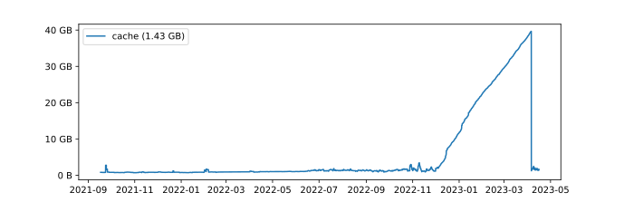

.. include:: links.rst

.. _assimilate_accessories:

Accessories
===========

.. _borg space:

Borg-Space
----------

`Borg-Space <https://github.com/KenKundert/borg-space>`_ is a utility that 
tracks and reports the space required by your *Borg* repositories.
It also allows you to graph the space used over time.

The following is an example of a graph generated by *borg-space* that allowed me 
to catch a problem that resulted in excessive growth in in the space required to 
hold my repository: in the switch from *Borg 1.1* to *Borg 1.2*, I had neglected 
to implement a compaction strategy.  The problem was resolved on April 5th.

